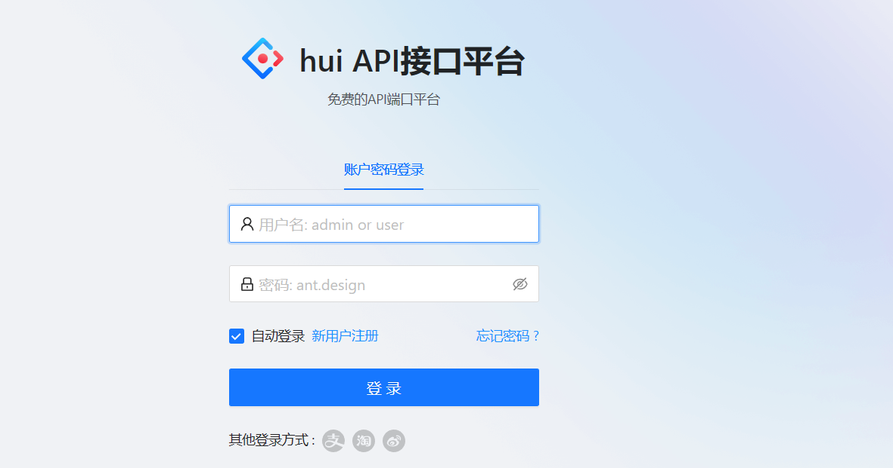
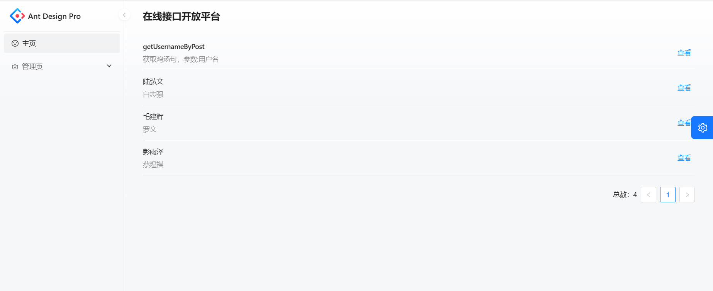
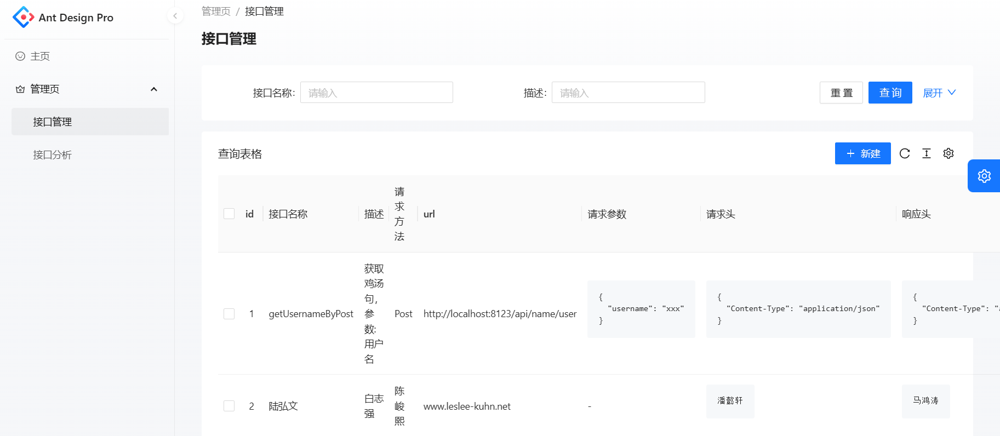
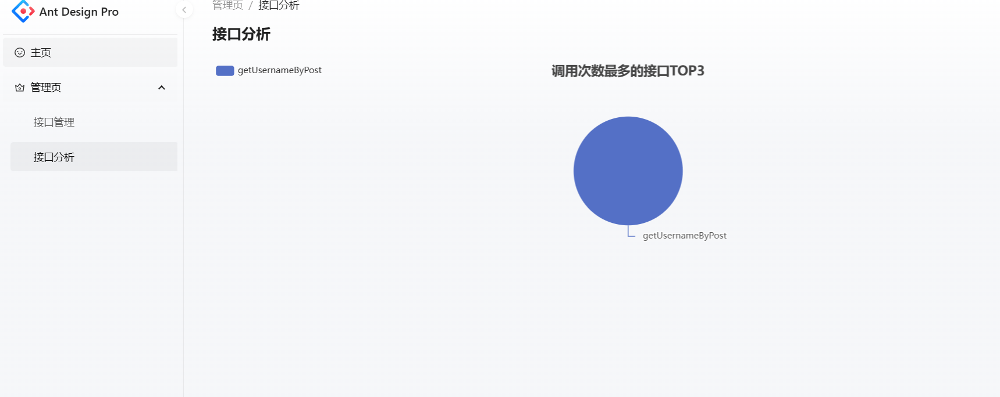
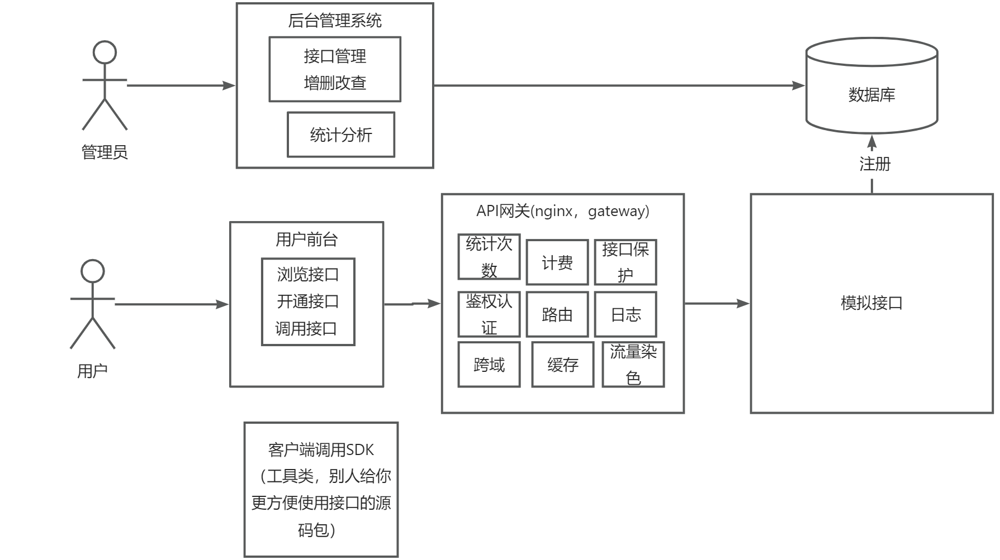
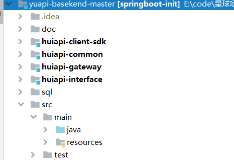

# 项目介绍
做一个API接口平台
提供API接口调用的平台，用户可以注册登录，开通接口通用权限
参考(http://api.btstu.cn/)
用户可以注册登录，开通接口调用权限。用户可以浏览接口并调用，且每次调用会进行统计。
管理员可以发布接口、下线接口、接入接口，以及可视化接口的调用情况、数据。
项目侧重于后端，包含较多的编程技巧和架构设计层面的知识。
# 部分截图
登录主页

调用页面  
//todo 接口信息未完善

管理页面 --->需要管理员登录

1.接口管理

2.接口分析

# 业务流程

# 技术选型
前端

* Ant Design  Pro 
* React 
* Ant Design Procomponents 
* Umi 
* Umi Request (Axios的封装)

后端

* Java 
* Spring Boot
* MySQL 数据库
* MyBatis-Plus 及 MyBatis X 自动生成
* API 签名认证（Http 调用）
* Spring Boot Starter（SDK 开发）
* Dubbo 分布式（RPC、Nacos）
* Swagger + Knife4j 接口文档生成
* Spring Cloud Gateway 微服务网关
* Hutool、Apache Common Utils、Gson 等工具库

后端总体代码截图

# 项目亮点
* 根据业务流程，将整个项目后端划分为 web 系统、模拟接口、公共模块、客户端 SDK、API 网关这 5 个子项目，并使用 Maven 进行多模块依赖管理和打包。
* 使用 Ant Design Pro 脚手架 + 自建 Spring Boot 项目模板快速构建初始 web 项目，并实现了前后端统一权限管理、多环境切换等基础能力。
* 前端：后端使用 Swagger + Knife4j 自动生成 OpenAPI 规范的接口文档，前端在此基础上使用插件自动生成接口请求代码，降低前后端协作成本。
* 为防止接口被恶意调用，设计 API 签名认证算法，为用户分配唯一 ak / sk 以鉴权，保障调用的安全性、可溯源性（指便于统计接口调用次数）。
* 为解决开发者调用成本过高的问题（须自己使用 HTTP + 封装签名去调用接口，平均 20 行左右代码），基于 Spring Boot Starter 开发了客户端 SDK，一行代码 即可调用接口，提高开发体验。
* 选用 Spring Cloud Gateway 作为 API 网关，实现了路由转发、访问控制、流量染色，并集中处理签名校验、请求参数校验、接口调用统计等业务逻辑，提高安全性的同时、便于系统开发维护。
* 为解决多个子系统内代码大量重复的问题，抽象模型层和业务层代码为公共模块，并使用 Dubbo RPC 框架实现子系统间的高性能接口调用大幅减少重复代码。